# Evrey's Modded Stronghold Crusader AIVs

The *V* in *AIV* stands for *Village*, by the way.

## Content
- [What is it and how to install it?](#how-to-install)
- [The History Pack](#history-pack)
	- [The new AI Lords](#history-ai-lords)
	- [The Rat](#history-rat)
	- [The Snake](#history-snake)
	- [The Pig](#history-pig)
	- [The Wolf](#history-wolf)
	- [Sultan Saladin](#history-saladin)
	- [The Caliph](#history-caliph)
	- [Sultan](#history-sultan)
	- [King Richard the Lionheart](#history-richard)
	- [Kaiser Friedrich I. Barbarossa](#history-friedrich)
	- [King Philippe II. Augustue](#history-philippe)
	- [The Wazir](#history-wazir)
	- [The Emir](#history-emir)
	- [The Nizar](#history-nizar)
	- [The Sheriff](#history-sheriff)
	- [The Marshall](#history-marshall)
	- [The Abbot](#history-abbot)
- [The Skirmish Pack](#skirmish-pack)
	- [The new AI Lords](#skirmish-ai-lords)
	- [The Rat](#skirmish-rat)
	- [The Snake](#skirmish-snake)
	- [The Pig](#skirmish-pig)
	- [The Wolf](#skirmish-wolf)
	- [Sultan Saladin](#skirmish-saladin)
	- [The Caliph](#skirmish-caliph)
	- [Sultan](#skirmish-sultan)
	- [King Richard the Lionheart](#skirmish-richard)
	- [Kaiser Friedrich I. Barbarossa](#skirmish-friedrich)
	- [King Philippe II. Augustue](#skirmish-philippe)
	- [The Wazir](#skirmish-wazir)
	- [The Emir](#skirmish-emir)
	- [The Nizar](#skirmish-nizar)
	- [The Sheriff](#skirmish-sheriff)
	- [The Marshall](#skirmish-marshall)
	- [The Abbot](#skirmish-abbot)
	- [Why would I want to use modded AI castles?](##Why-would-I-want-to-use-modded-AI-castles?)
	- [What does this Mod better than Firefly?](##What-does-this-Mod-better-than-Firefly?)
- [How can I contribute?](#contribute)
	- [Creating a Pull/Merge Request](#pull-request)
	- [Just filing an Issue](#issue)
	- [Suggesting a re-design of an AI lord](#re-design)
- [License](#license)

##  What is it and how to install it?

This is a mod for the game [Stronghold Crusader HD](http://store.steampowered.com/app/40970/Stronghold_Crusader_HD/) that replaces all of the original AI lord castles with new and improved ones from me, [Evrey](https://github.com/Evrey), with some special thanks going to [Heroesflorian](https://github.com/Heroesflorian) for his valuable help to make the castles even better. To use this mod you have to download or clone this repository and copy all files from the `./skirmish/` or the `./history/` directory to the `aiv` directory of your Stronghold Crusader installation, after deleting *all* the 128 original files. For the Steam version of Stronghold Crusader HD, this directory is located at `<Steam Directory>/steamapps/common/Stronghold Crusader Extreme/aiv/`. If you want to have Firefly's original AI castles back, you can copy the files from `./firefly_vanilla/` to the game's `aiv` directory.

Additionally, **if you just want to fix the bugs of Firefly's castles**, then copy all files from `./firefly_fixed/`. Those are Firefly's original castles with a few fixes applied, like the addition of missing defenders where useful, the addition of required gatehouses, or adding important economical buildings Firefly forgot.

#  The History Pack

This is a pack of 16 new castles, all based on real historical ones. These are *not* skirmish campaign optimised and often need quite a lot of space in one direction. Big surprise, real historical castles often tend to grow away from the keep, and real castles are quite often rather long and thin if built on a rock or mountain.

The castle miniatures are not entirely to scale. Sometimes castle sections get squished, sometimes cut away. The required buildings for a bot's economy are just too huge to fit into real historical castle designs, and the keep cannot be re-positioned. You can judge the compromises I made yourself, as every castle preview picture is accompanied with a floor plan, satellite image, or otherwise reconstruction of the reference castle. If possible, a moat is added to all castles in two cases: If the reference castle has a moat there as well, or if there was a cliff blocking access.

##  The new AI Lords 

###  The Rat

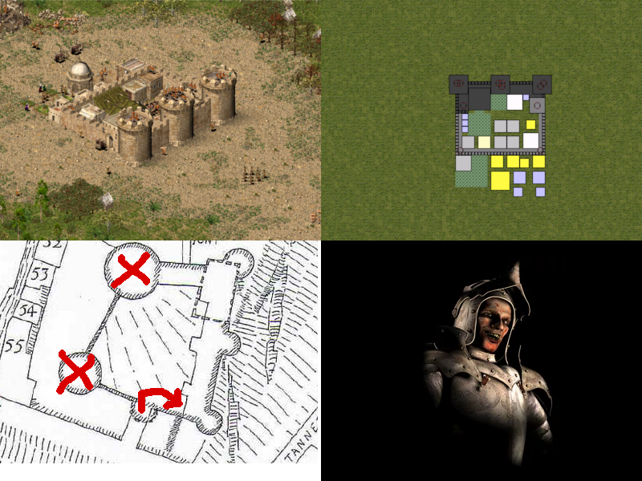

This castle is based in Château de Culan. It is tiny, it looks cool, it was quite often besieged and destroyed, and it lies in the Plantagenêt half of medieval France. Wait, France? Well, the Rat's name *is* de Puce, and the Plantagenêts were a dynasty in hold of the English throne.

###  The Snake

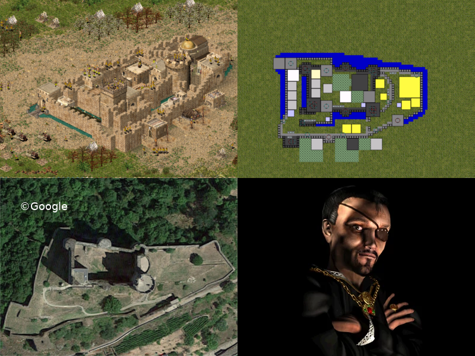

Dear earl Beauregard got himself a french castle as well: Château de Najac. It is decently sized, quite fitting for the rich Snake, was never conquered, and at one point in history was used to imprison some Knights Templar. Now, as far as I remember, the Knights Templar went down due to back-stabbing from the french King, who apparently owed them a lot of money. The Knights Templar were quite present in Europe as well, escorting travellers, and acting as an early bank, sending their profits to the Outremer.

Backstabbing and money... well, if that doesn't sound like Beauregard.

###  The Pig

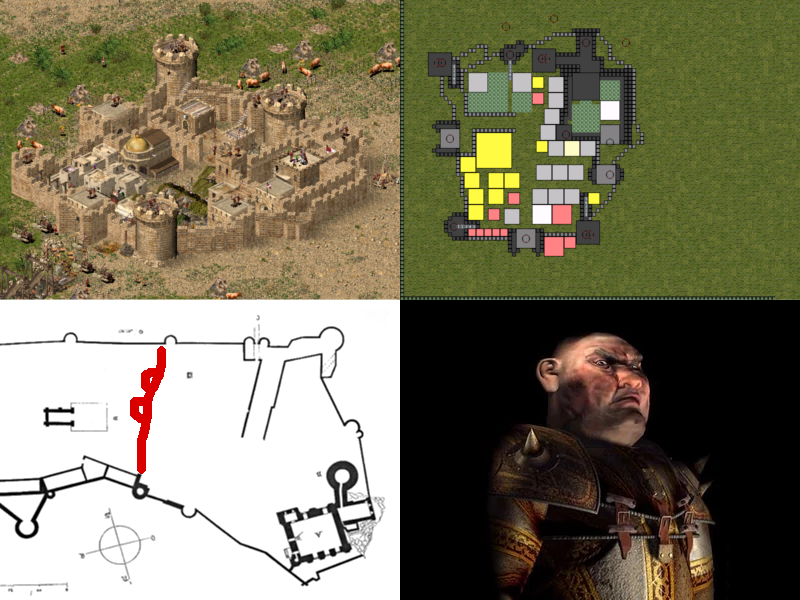

Big surprise here, Duc Truffe got a french castle. This time it's based on Château Falaise. The red line in the image shows where I had to cut the outer bailey in half. There is an outer gate at the original tip, I just moved it to the red line. Well, okay, even if I had the space to build the full outer bailey, the Pig's economy would provide pretty much nothing to fill all that space.

Now, there is just one reason why I picked this specific french castle, besides also being located in the then Plantagenêt half of France. See that big round tower attached with a piece of wall to the donjon? To me that feels pretty much like vanilla Crusader Pig architecture.

###  The Wolf

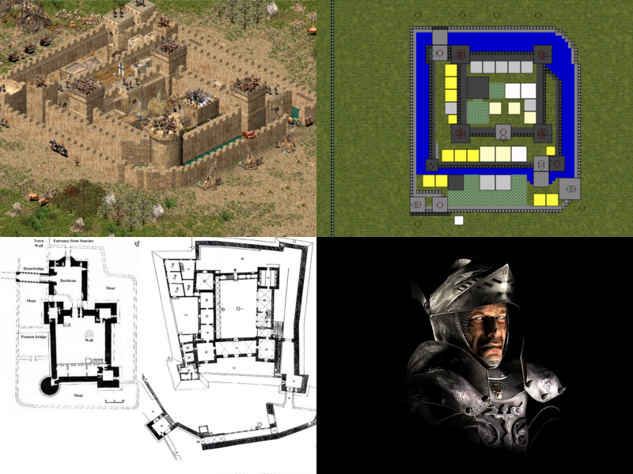

Duc Volpe, well that's not a french name, isn't it? Indeed it is italian and means fox. Wolf, Duc Fox. Weird. Well then, the Wolf may be italian. Quite fitting, as I find his italian voice acting in Crusader 2 to be the best.

His castle is based on what seems to be a common style in northern Italy, two castles in specific: Rocca di Soncino and Castello di Torrechiara. Soncino is the one with the round tower in one corner and was built right at the corner of the walls of the city of Soncino, with the round tower facing outwards. Those castles have multiple concentric-ish layers of defence, a nice ballance between symmetry and asymmetry, and sit in the then german-ish part of today's Italy.

Soncino is in Lombardy, one of the regions of northern Italy where emperor Frederick I. had a good bunch of military fun and failure. Quite fitting, as in my opinion, given the fixes done by the [Unofficial Crusader Patch](https://github.com/Sh0wdown/UnofficialCrusaderPatch) Frederick is the second strongest bot in the game, not far behind the Wolf.

###  Sultan Saladin

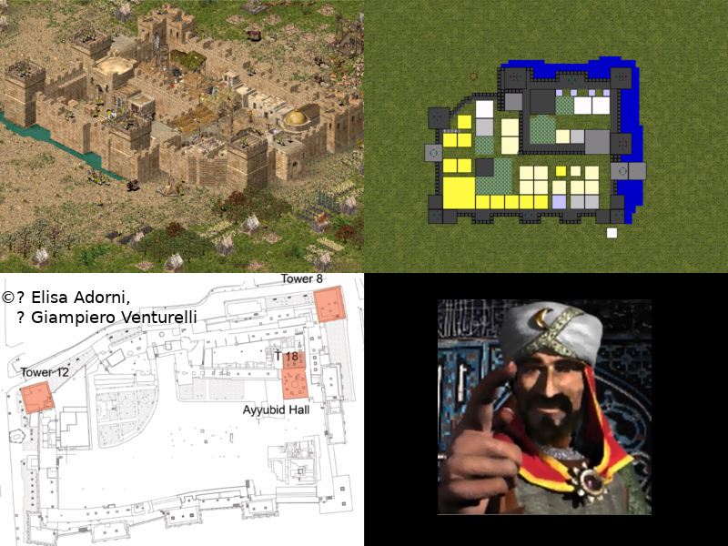

Now, this is a fun one. There are some castles and citadels named after him, most notably the Citadel of Saladin, which he ordered to be constructed near Cairo. Obvious pick then, right? Well, not really... While Egypt was an enormous source of money and goods for Saladin, Sultan of Egypt, and while the citadel was constructed to defend Cairo against the crusaders, Saladin had absolutely no love for Egypt. Apparently, to him Egypt was but a necessity. Instead, Saladin greatly favoured Damascus and Syria in general. So, the castle Saladin builds is the medieval citadel of Damascus.

Oh, the church? Unlike Crusader 2, Crusader 1 has no mosque skins for muslim lords. Just imagine those churches to be mosques. It would be weird for a muslim city to not have a mosque, especially if its Sultan calls himself "salvation of the religion".

###  The Caliph

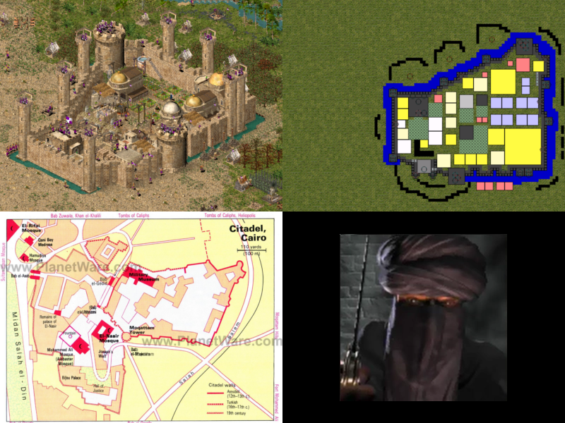

As far as I understand it, a caliph is a pope-ish person for the muslims. A notable dynasty was the Fatimid Caliphate, that once conquered Egypt and established Cairo as their capital. So, obviously, the Caliph should get something from Cairo. How about this Citadel of Saladin, then? Just as a little bit of irony. The Caliph builds the citadel using the high medieval layout. Unlike the historical citadel, but quite fitting for a pope-ish guy, a lot of religions buildings fill the castle ward. Now the Caliph can burn those "infidel" crusaders while defending Egypt.

### The  Sultan

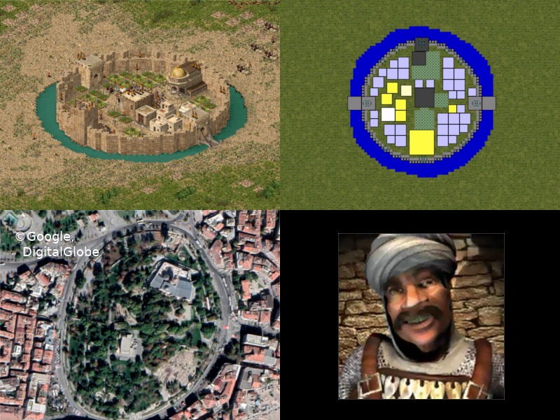

The Sultan is a bit tricky and indeed might reveal a bit of historical research done by Firefly Studios. A notable Sultan during the first few crusades was Kilij Arslan ("Lionsword") II. of the Sultanate of Rum. The very one who tried and failed to stop emperor Frederick I. Barbarossa from crossing through today's Turkey.

I found it to be ridiculously difficult to find anything on medieval city walls or castles in Turkey, especially on Konya. Konya happened to be the capital of the Sultanate of Rum, but I couldn't find anything on the medieval layout of the city of Konya. Instead what I found was Alaeddin Hill park within the city. Looks familiar, eh'? Round-ish, full of gardens... There was an old fortification on this hill, and there is a big mosque. Not much to work with, but I guess it is better than really finding a map of medieval Konya. I mean... what would I be supposed to put inside the walls? The Sultan builds nothing! Oh dear... I guess Firefly faced the exact same issues back then.

###  King Richard the Lionheart

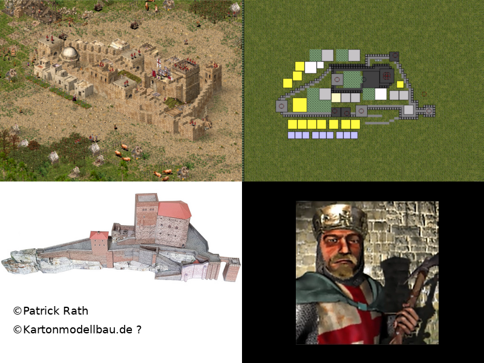

Now, I had some fun with this guy. =) Richard, King of England, Duke of Normandy, Duke of Aquitaine, Duke of Gascony, Lord of Cyprus, Count of Poitiers, Count of Anjou, Count of Maine, Count of Nantes,... wait. Those are a lot of french names, eh'? Indeed, this guy ruled over 50% of medieval France. He was more powerful than the French king in his own land! And he was King of England. And he felt worse for England than Saladin felt for Egypt. Apparently, people in his time joked about that Richard would sell England to fund the crusade.

Well, give him a french castle in Aquitaine or something then, eh'? Well, I could've... but instead I gave him Trifels. A german castle in which Richard was imprisoned after the third crusade. Why was Richard imprisoned? Well, look up the aftermath of the Siege of Acre.

###  Kaiser Friedrich I. Barbarossa

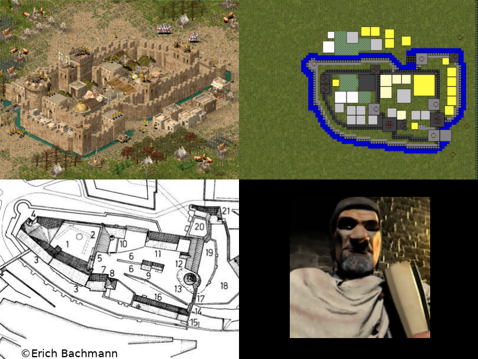

Ah yes, Frederick, that steamrolling badarse who might've conquered Jerusalem if he didn't drown. Put simply, he got the castle of Nürnberg. During the middle ages, there was no such thing as a capital in the German empire. For the most part, every duke did their own thing. The emperors moved from duchy to duchy, asserting their dominance, and occasionally guiding the dukes into a direction they felt benefited the empire as a whole. There was one castle, though, which apparently was the favourite residence of most medieval german emperors, and there is no medieval german emperor who did not at least once reside in this castle: Nürnberg.

###  King Philippe II. Augustue

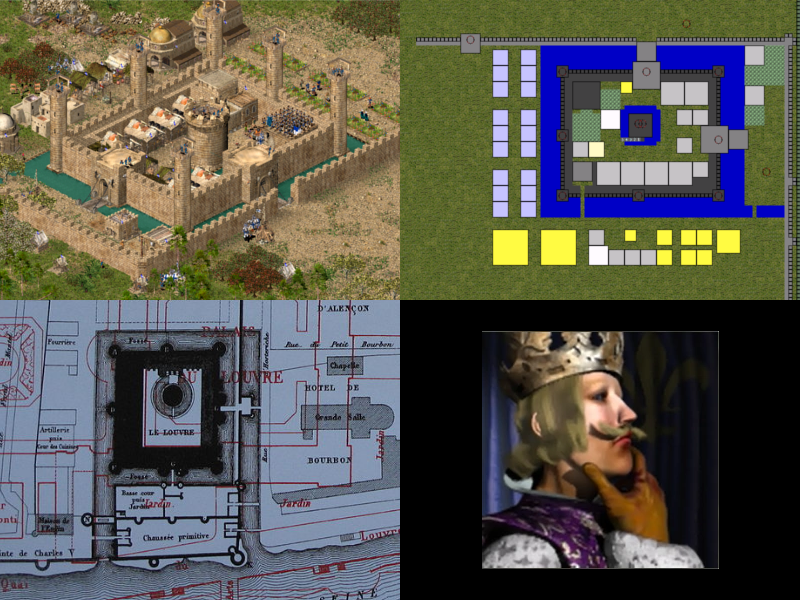

The real Philipp II. was quite the badarse, managed to kick Plantagenêt butts and conquer most of Richard's 50% of France. He and Richard mostly left for the third Crusade together, because Richard knew he would do all that behind his back. Well, then Acre happened... Anyways, before Philipp II. left for the crusade, he ordered the construction of a new wall around the wealthy city Paris, a wall that would be named after him. At its weakest point, near the river Seine, a new castle was built: The Louvre. All so that in turn, behind Philipp's back, Richard wouldn't grab more french territory.

Well, Philipp's castle in this pack is the Louvre.

###  The Wazir

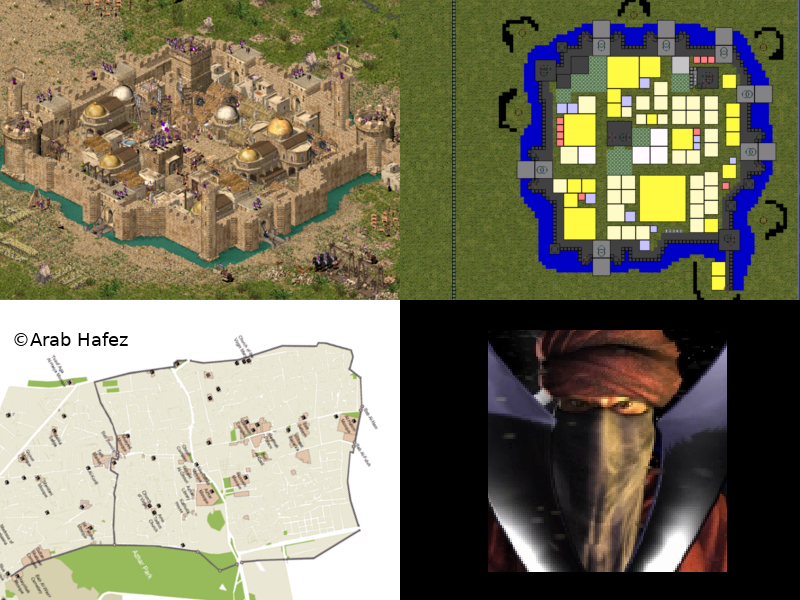

The Wazir, unsurprisingly, is a vizier, which is a highly-ranked political advisor or minister, but also sometimes a representative of a caliph. Hmm, we do have a similar-looking guy in this game, who - just like Wazir - likes to burn things. The Caliph? In this interpretation, the Wazir is the representative of the Caliph, and so he should get something from medieval Cairo as well. How about the city itself?

I tried my best modelling the rough shape of the city walls and positioning the gates of Cairo. Yeah, I know, those are quite some gates. Cairo has a ton of mosques in there, so naturally the Wazir builds a lot of religious buildings as well, roughtly at mosque locations. The big square tower is an unhistorical addition. As gates throughout the Stronghold series are pathetically weak, there needed to be something protecting this "weak spot" where the septillion city gates gather.

For reference, the Citadel of Saladin is located a bit south of the city, or left on the reference picture.

###  The Emir

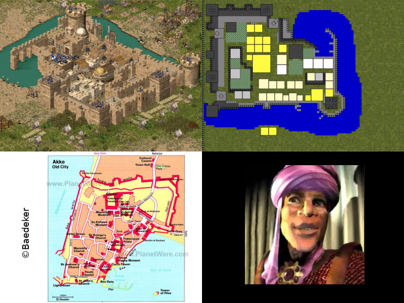

I tried finding a few names of notable Emirs during the third Crusade, but couldn't find anything, so I looked into what an emir was, back at that time. Apparently, an emir was a military commander or general, who sometimes acted as a gouvernor. Okay, well, so what's the Emir governing, then? I gave him Acre. This is a game about the third Crusade, after all, and Acre was quite the big epic showdown... and long tedious siege. The strategically most important city of Acre, held by muslim forces, the camps of the Crusaders besieging Acre, eventually including the forces of Richard and Philipp, and the camp of Saladin and his forces laying siege to the Crusader's camps. Yeah, a siege during a siege. The fuck.

And so, in my interpretation, the Emir is the governour of Acre, a general of Saladin.

###  The Nizar

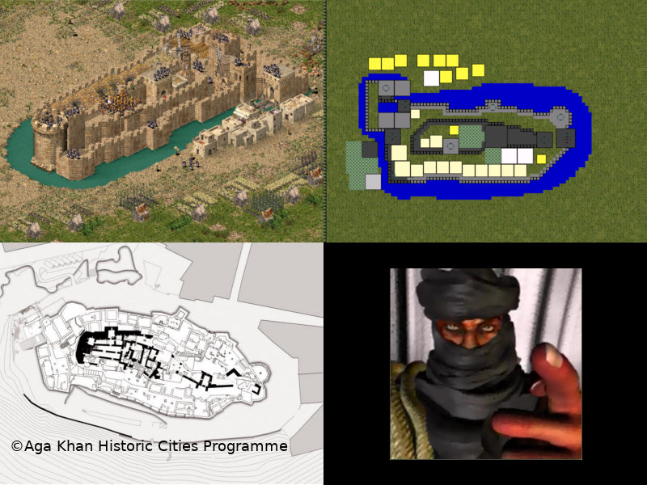

The Nizar is a Hollywood Ninja throwing Hollywood Ninja en masse at you. Said Ninja are called assassins in the Stronghold series. Well, the order of the assassins did exist, and they did assassinate a lot, and as every player of the first Assassin's Creed game knows, their home was Masyaf castle. Now, the real Masyaf looks nothing like the poor thing in the Assassin's Creed game, though.

###  The Sheriff

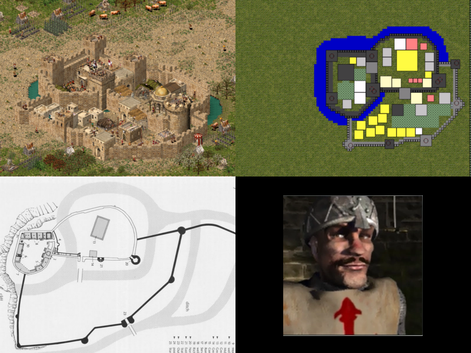

... of Nottingham obviously gets Nottingham castle. Again, it looks like Firefly did their research here. The third castle ward did exist during the high middle ages, first enclosed in wooden walls, later in stone walls, and so I added it. Also gives me more usable space despite me having to squish the castle walls.

To match Robin Hood lore, the Sheriff builds a prison and a few gallows.

###  The Marshal

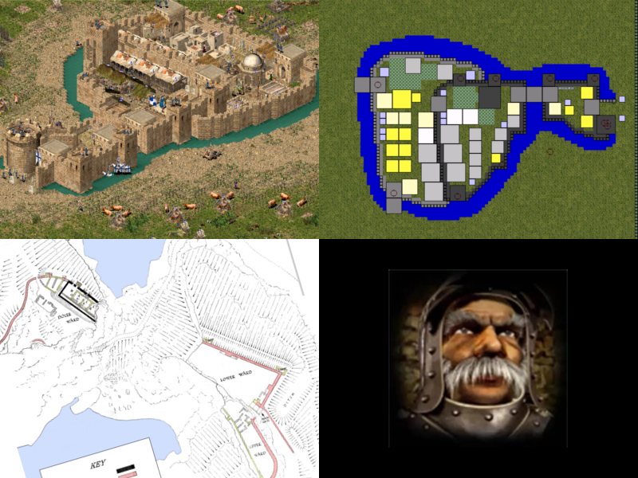

Marshal is... interesting. He's brave, knightly, dispatches tons of knights, and guides you throughout the story of Stronghold 1. In Stronghold 1, you two start out in the very south-west of England, so I picked a castle from around there. A notable find was Tintagel castle. Did I mention that the Marshal is quite knightly? Tintagel has quite a big role in the legend of King Arthur.

The two back gates are there for gameplay reasons. The real Tintagel sits on a peninsula.

###  The Abbot

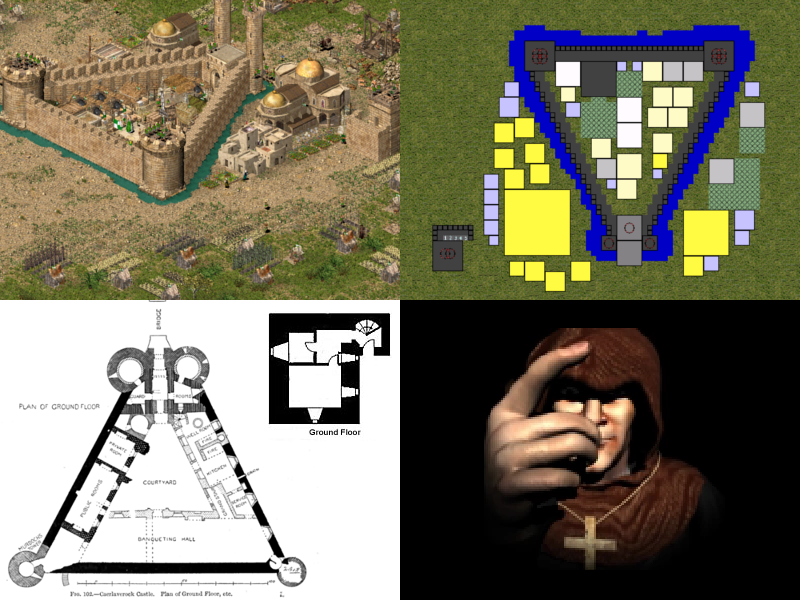

Okay, this one is a bit silly. The Abbot got Cærlaverock castle, a scottish castle. So far so good. Now, if one tries to trace back who built this castle, you'll stumble upon the name Undwin and a bunch of others. Undwin? Well, there is this german Let's Player with a big focus on the Stronghold series, who also loves to make cringeworthily bad abbot-based puns. Welp, guess the Abbot gets this castle, then.

As a bonus, there's a tower protecting the Abbot's cathedral from the side. See it as a minuature of the Abbot's Tower in Scotland, a 16th century tower house.

#  The Skirmish Pack

This is a pack of 128 new castles for the 16 vanilla lords. All castles are optimised and tested for all 100 skirmish campaign missions. Yes, that's all 50 original, 30 HD release, and 20 Extreme skirmish missions.

##  The new AI Lords

###  The Rat

The Rat now actually builds a proper castle, which is inspired by Norman Keeps and high medieval gatehouses with flanking towers. Usually, the Rat encloses his granary and armoury within the castle walls, perhaps even very few weapon makers. The new Rat also builds some gardens or statues to boost what pitiful "army" he has.

What you see here is the Rat's smallest castle, which encloses nothing but the keep.

###  The Snake

Did you like vanilla Snake #3, the snake-and-"S"-shaped castle? Well, that's his architectural style for all of his castles now. Curvy snake walls. To enhance the curvyness, the new Snake uses round towers only, making him the only european lord to use round towers. *(With one tiny exception.)*

As an easter egg, one of his castles is a rather... edge-y... rectangle-ish... thing using square-shaped towers.

###  The Pig

All in all, the pig still builds his... weird... wall thing with low walls. Granted, it does have style. This time, however, the Pig separates his castle into two sections. The inner castle, enclosed by high walls, has at least one big tower on wall arms attached to it. Those towers even have tower mangonels! Good thing there aren't any campaign missions where you or your allies have your castles right next to a Pig, right...? Right...?! The second section is the castle village, enclosed by those small walls as you know and like them.

Unlike the vanilla castles, this Pig builds bad stuff all over the place. Dungeons, racks, chopping blocks,... everything there is to be built. This isn't enough to give him -5 popularity, but it surely is enough to emphasize his character. Really, why didn't Firefly give him more than occasionally two gallows?

###  The Wolf

The Wolf now has a more unified architecture, though each of the castles still has a recognisable individual style. Basically, the Wolf now builds a thick rectangular center castle with two rows of three towers and two gates between those rows. Sometimes the shape is not very... rectangle-ish, though, as you can see in the screenshot. You can still see the general style of two three-tower-rows, though. The Wolf also no longer has multiple castle sections as you know them from e.g. Firefly's Wolf #1 or Wolf #3. This single section and thin outer wall architecture allows all of the Wolf's new castles to be way more compact than the Firefly versions, while also having much better and redundant economy paths.

As an easter egg the Wolf now also builds good stuff instead of gallows and what not, due to several hints in the lore of *Stronghold 3*. *(Yes, as a game Stronghold 3 is rubbish, but it had good ideas and the story around the Wolf was pretty neat.)*

###  Sultan Saladin

You might recognise his vanilla architecture, which is mostly influenced by vanilla Saladin #1. Similarly to the new Wolf, Saladin has a front line of three mangonel towers and a back defence of two ballista towers protecting his castle. In addition to that, he likes to cover his secondary entrances with towers like vanilla Saladin #1.

###  The Caliph

Oh, did you like his towers? Yeah, how do I say this... err... well, there is less of 'em. Eight towers, to be precise. Unlike before, those towers are heavily manned. Additionally, destroying the Caliph's toothpick towers does not create a breach. Thus, the Caliph completes his castles quicker and protects them better at the same time.

###  The Sultan

The Sultan loves round shapes. They remind him of his lovely olive twigs, the ones mourning whenever evil is done towards the poor Sultan. And he loves gardens a lot. At nights, the Sultan likes to lay down in his beautiful flower beds, watching the stars for clues about when would be the perfect time to attack you. As no mere civilian is allowed to disturb the Sultan while having his peace in the gardens, no house is allowed to be built within his palace's walls.

### King Richard the Lionheart

Huh... does this castle look familiar? I guess... could it be?! It is! Richard now builds the castle shown on the cover art of *Stronghold Crusader*. Completely unified with two round mangonel and two square ballistæ towers, and always a church and a chapel in his inventory.

Can you spot the easter egg? Well, have a close look at your *ally*. :)

###  Kaiser Friedrich I. Barbarossa

This castle has propably the most historically accurate layout you'll ever see in a Stronghold game. As an easter egg, all of Frederick's castles are architecturally inspired by the castle of Nürnberg. This castle is known to have been the favourite residence of many emperors of the so-called *Holy Empire* and thus I gave it to Frederick.

Frederick's castles consist of three sections, one in front of the next one. To improve his castle's defences, a section's walls are never connected to an other section's walls. And thus, unlike e.g. the castles of the original Wolf, you cannot take over the whole castle by pushing just one siege tower somewhere against the walls. The original castle is built on a hill-rock-thing. To compensate for the lack of such positions in *Stronghold Crusader*, Frederick's castles are surrounded by a thick moat.

###  King Philippe II. Augustue

Well, it's Philipp, so don't expect a defensive architectural masterpiece. I said don't! What is this? A proper starfort. With a watch tower. It's almost as if he got a level up in competence. And then this outer village wall. Small enough for the archers behind to shoot over it. A large moat with drawbridges. Ballista towers. Knights defending specific spots at the moat. I am almost impressed, and there surely is no way Philipp could have fucked up.

Well... he did. His Maginot Line is - *(not)* surprisingly - quite open at the back. Just walk around it and attack the star fort directly, or his economy. You might even walk around the outer wall to climb up its stairs. Did this guy think his castle architecture through? Perhaps he had to spend too much money for his gardens and churches, leaving no Gold coin for further stone purchases.

###  The Wazir

He went from star-shaped castles to a triangular one. Sometimes the Wazir adds external bastions to his inner castle, making it a double-triangle or six-pointed star. This shape allows him to keep his star-ish style while also being more space-efficient. Now, more of his bread industry can be built inside his inner castle, securing it from fires. The new Wazir also makes better use of moats, including the pitch ones. Oh, and did I mention that the Wazir now makes use of tower-mounted siege engines? And has less torture and execution devices?

As a surprise, a few of his castles have a double-gatehouse with flanking towers.

### The Emir

The new Emir now has an outer and an inner castle wall. His basic style is somewhat kept intact: An octagonal castle with big round towers and gatehouses on the edges. Unlike his vanilla design, though, the Emir's toothpick towers are no longer a path-blocking extension of his inner castle, but are connected to the corners or sometimes edges of his lower outer wall. This gives Emir's castle the feeling of a miniature city with a massive palace at its center.

As an easter egg, one of the Emir's castles has its walls swapped: The outer city wall is high, big, and has massive towers, whereas the inner wall is small, thin, and has those toothpicks attached to it.

###  The Nizar

Oh, what's that! Walls! Eww... At least they aren't high. Well, the new Nizar builds a spiral wall, surrounded by a thin moat. Sounds too extreme compared to vanilla Nizar? Well, it is a mod, you don't have to use it. But lemme explain:

The new Nizar is way more compact, having a much smaller industry. He still makes enough money, so that helped shrinking his castle. And that's the main point: His new castle is much, much smaller than in vanilla. He no longer digs away all that farm land around him and he no longer keeps a big hole in his moat because of a mere farm.

The new Nizar also has a little... dangerous surprise for you. One of his castles even warns you with a big danger sign.

###  The Sheriff

Do you like his vanilla design? Well, I do, which is why I kept the overall style. The Sheriff's new castles are basically a more compact version of the vanilla ones with added defensive features. After all, the better the poor Sheriff can protect his tax payers, the more taxes he can collect! The new Sheriff protects his castles with a tower ballista and a line of fire ballistæ. Additionally, his pitch moat shrunk in size, cutting the moat renewal costs in half.

For those damned criminals not paying him the taxes, the Sheriff always has dungeons available. Some prisoners await their special treatment on the rack, while the bankrupt ones will see gallows and gibbets in the inner castle. He's such a nice guy, eh.

###  The Marshall

The new Marshal learned a few tricks to improve his old architecture. He patiently studied the other AI lords and adapted whatever he felt comfortable with. From Frederick, he learned to use defensive trebuchets, so he got one. From Saladin he learned that offsetting the towers from the walls they protect is a good thing to do. The Snake showed him how useful enclosing his front lines with a moat is. Finally, from the Wolf he learned that it might be useful to force the enemy through multiple gatehouses if they dare storming his castle. Sadly, the Marshall learned from Richard how to man his towers.

###  The Abbot

Again, a castle you might not recognise at all. This time, however, it is quite easy to just guess who lives there. The new Abbot's castle now has a shape similar to floor plans of gothic cathedrals. In addition to that, the new Abbot's castles are more compact than his vanilla ones and always have multiple entrances, fixing all those issues where the Abbot would imprison himself in way too tight spaces.

Fun fact: The Abbot is the first AI lord I ever modded. Back then I just added a secondary front gatehouse to all of his castles.un fact, the Abbot is the first AI lord I ever modded. Back then I just added a secondary front gatehouse to all of his castles.

As an easter egg, one of his castles is turned by 45°, resulting in an actual cross shape as seen by the player, instead of an X shape due to the isometric perspective. The new Abbot also has a good, faithful heart. He is especially good to the children of his abbey.

##  Why would I want to use modded AI castles?

There are quite a lot of issues with Firefly's original AI castles that have not yet been officially fixed, some not even since *Stronghold Crusader's* first release back in September 2002. *(The original release only had 8 AI lords instead of today's 16.)*

- Two castles of the Snake don't have an entrance. The Snake imprisons himself, starving his people to death and thus removes all the exterior *(i.e. unreachable)* industry. This even happens in campaign missions, making him a useless ally in one mission. `./firefly_fixed/` adds gatehouses here.
- Two other castles of the Snake have wall sections with towers that are unreachable, due to missing stairs or connections to a gatehouse. This renders half of his castle's defense useless. `./firefly_fixed/` adds stairs to those wall sections or re-connects them to other wall sections.
- In one castle Firefly forgot to give Richard his tunnelor guild. Thus, Richard cannot dig tunnels during sieges, making Elon Musk very disappointed. `./firefly_fixed/` adds the missing tunnelor guild.
- One of the Caliph's castles has his only gatehouse placed in such a perfect way, that a cactus nearby his castle blocks the entrance, rendering the Caliph as useless during this campaign mission as the Snake. *This is not yet fixed in `./firefly_fixed/`*.
- One of King Philipp's castles is actually missing an armoury, which means that he will *never* recruit any troops. `./firefly_fixed/` fixes this by replacing an armourer with the armoury. An easy to make mistake, thanks to the... eww AIV editor UI.
- One of the Sheriff's castles is missing an engineers guild. No catapult fun for him, then! Except for `./firefly_fixed/`, where this engineers guild has ben added.
- The Rat's castles exist. And they still exist in `./firefly_fixed/`.
- Though most of the Wolf's castles do look pretty cool *(and unrealistic)*, most of them have terrible economy paths, resulting in such a bad economy that the Wolf can barely raise some armies or recruit any defenders. In addition to that, many castles of him are just too big for just about every map. Because of that, two castles have been fixed in `./firefly_fixed`: #4 got additional gatehouses near the back to work around that ridiculous front stairway, and #6 got a well-protected front gatehouse and stairs.
- In all castles of the Abbot and in quite some castles of the Wolf, the only gatehouse is facing south. Not just that, but those castles also tend to be quite broad... too broad for many positions on many maps, even during campaign missions. This results in the Abbot and the Wolf imprisoning themselves in their own castles by blocking the only paths leading to their southern gates. Said castle of the Wolf is #6. Besides that, `./firefly_fixed/` adds a big front gatehouse to all castles of the Abbot.
- Some AI castles are only accessible through a drawbridge. While drawbridges are awesome, they are problematic in this game. If you destroy the gatehouses to which the drawbridges are connected, and if the besieged AI lord cannot get any more stone and wood *(bankrupt or destroyed market)* to repair the gatehouse and drawbridge, then he is imprisoned by his own moat. And as an AI lord does never delete his own moat, this results in him staying bankrupt and imprisoned forever. `./firefly_fixed/` does not change that.
- There are many, many more issues with the original AI castles, e.g. castles having way too few houses. In case of the houses, a lot of castles got additional ones in `./firefly_fixed/`.

##  What does this Mod better than Firefly?

Note that the modded AI castles have been tested with all 80 campaign missions of *Stronghold Crusader HD*. The campaign of *Stronghold Crusader Extreme HD* has also been tested, but not as much as the others. So in theory, this mod should work perfectly for all 100 campaign missions.

- This mod attempts to have no bugs in the castles. No missing gatehouses, no gatehouses facing the wrong directions, no missing tunnelor or engineer guilds, not too few houses, etc. I'm not infallible, though, so please file issues if you spot any bugs.
- Please note, that M27 is buggy as hell, due to the map itself being buggy. No AI modding whatsoever can fix that. There is another broken map in the Extreme campaign, but I forgot the mission number.
- Except for the Snake, all moat-digging AI lords have at least one line of gatehouses without a drawbridge, so that they won't imprison themselves with their own moat.
- No castle sections or gatehouses are cut off by vegetation *(e.g. cacti, which came from America and should not exist in this game)* in the campaign missions.
- The Abbot always builds his cathedral before he builds his market. Otherwise the Abbot tends to go on a fast shopping tour, making him bankrupt right before he is about to invest that 1000 gold for his only source of melee troups.
- The bigger AI castles, especially those of the Abbot and the Wolf, always have multiple entrances on different sides. This makes it highly unlikely that the AI would imprison itself due to ridiculously narrow terrain. In addition to that, it makes it unlikely that all the gatehouses will be closed during a siege.
- Many of the economy paths have been optimised, especially the Wolf's and Nizar's.
- The Rat actually has a castle now.
- Sometimes this mod follows the basic design ideas of Firefly, and sometimes this mod does its own thing. All in all, though, all AI lords still have a distinct style not too far away from vanilla.
- Most castles have become more dangerous than the vanilla ones, especially the Pig's.
- All castles have a similar and sometimes even the exact same number of buildings as the vanilla castles use. Other times, the new castles have a simpler but at the same time more effective economy.
- All castles also stay within the vanilla castle's bounding box, often times being smaller due to a more compact design. E.g. *"if castle #X of AI lord Y extends far to the keep's right while being 20 tiles in broadth, then the modded castle #X of lord Y also extends far to the right and is about 20 or even less tiles in broadth"*. This is very important, as most of the time specific castles of an AI lord are cherry-picked due to their shape, so that it definitely fits the map during a campaign mission. Shape meaning the castle ID. There is no code in the game analysing a castle's geometrical properties. The most notable example of this is castle #8 of the Wolf, which is this tiny little thingy Firefly likes to put near a map's borders.
- Most AI lords have an *"easter egg castle"*, i.e. a castle that is just... weird but still fits their style.

#  How can I contribute?

##  Creating a Pull/Merge Request

As mentioned before, the *Stronghold Crusader Extreme* campaign is only roughly tested and might need a lot of fixes. At the same time, there might still be slight issues with the original 80 mission campaign or during random skirmish matches you might want to fix. You will need an installation of this game and the *"Stronghold Crusader AIV Editor"* to make any patches. To get the AIV editor, open your favourite search engine and look for *"Stronghold Crusader Community Tools"* or *"Stronghold Crusader Modding Tools"*. Once you have downloaded those tools, you have to copy this mod's files from the `./skirmish/` folder into the AIV editor's `villages` folder. After that is done, you can start editing the AI castle files.

- Make sure that your fixes don't break any of the 80 campaign missions of *Stronghold Crusader*, at best also not the 20 missions of *Extreme*. As a fast check you can start a match at a speed of 90 and observe what the AI lords build during the first 3 to 10 minutes. In tighter spaces, however, longer observation will be required, as too many blocked houses will break the AI's industry thanks to a lack of workers.
- Also make sure that your fixes don't break the architectural style of this mod.
- The first construction steps of an AI lord should be, in order:
	0. Where needed, the first Mill. (Nizar)
	1. More Stockpiles
	2. Granary
	3. Armoury
	4. Cathedral (Abbot)
	5. Barracks / Mercenary Post
	6. Engineer's Guild
	7. Tunnerlor's Guild (Richard)
	8. All the houses
	9. First wall sections
	10. Maybe first gatehouses or towers
- Make sure to insert 30-steps breaks at specific castle construction steps to give the AI time to collect e.g. more stone for towers to be built after the breaks.
- Don't forget to copy any changes back to your working copy of this repository. Also don't forget to copy your changes to your installation of *Stronghold Crusader* to test your changes.

If you are done editing your AI villages, submit a pull request containing the following information:

- Describe what you changed.
- Describe *why* you changed specific things. This is most important.
- Please, add a screenshot showing the issue with the original mod castle.
- Please, also add a screenshot showing your changes in action.
- If your pull request fixes specific campaign missions, then list them as `Crusader #1-80` or `Extreme #1-20`.
- If your pull request fixes a custom skirmish match, then add the following information:
	- Add a screenshot showing your custom skirmish configuration.
	- The screenshot needs to show the chosen AI opponents, their colours, their names, and their positions on the map.
	- The screenshot also needs to show the game mode and the start resources.
	- And it obviously needs to show the chosen map. Only Firefly originals in single player mode are valid. No fixes for custom maps made by the comminity or yourself. If an AI lord has an issue with custom-made maps, then fix the custom-made maps. Also don't submit fixes for something that only occurred during a multiplayer game, as this makes it hard to reproduce the original issues.

##  Just filing an Issue

In case you don't feel competent enough to use Firefly's AIV Editor, or if the AIV Editor simply doesn't work on your computer and operating system, or if you just lack the time to fix things yourself, you can just file an issue, so that I can have a look at the problem and fix it myself. Though I cannot guarantee to have time for that myself right away, I will eventually.

When creating an issue, I will need about the same information as for pull requests:

- Describe what should be changed.
- Describe why this should be changed.
- Add a screenshot showing the issue you have.
- If the issue occurred during specific campaign missions, then list them as `Crusader #1-80` or `Extreme #1-20`.
- If this issue occurred during a custom skirmish match, then add the following information:
	- Add a screenshot showing your custom skirmish configuration.
	- The screenshot needs to show the chosen AI opponents, their colours, their names, and their positions on the map.
	- The screenshot also needs to show the game mode and the start resources.
	- And it obviously needs to show the chosen map. Only Firefly originals in single player mode are valid. Don't file issues for custom maps made by the comminity or yourself. If an AI lord has an issue with custom-made maps, then fix the custom-made maps. Also don't submit issues for something that only occurred during a multiplayer game, as this makes it hard to reproduce the original issues.

##  Suggesting a re-design of an AI lord

In case you have an idea on how to improve the castle designs of a specific AI lord, e.g. if you have an idea for sexier Sultan castles, then feel free to create an issue so that we can discuss your ideas.

As exact castle layouts in *Stronghold Crusader* are hard to describe, you should add pictures in your issue showing your design ideas. Those pictures can be any of...

- ... pencil drawings on paper.
- ... a screenshot of an AI lord's or your own castle while in the game. In ye olden days, I used the sandbox mode or the map editor to plan AI castles.
- ... a screenshot of the AIV Editor showing your new castle design, propably accompanied by the actual `.aiv` file.

Also, don't forget to mention which castle(s) your designs are meant to replace, what the benefits of your designs are, what you missed in the original mod designs, etc.

#  License

Keep in mind that this is just a mod for *Firefly Studio's* game *Stronghold Crusader (Extreme) HD*. Without this game, this mod is worth nothing.

Anyways, the mod itself is published under the MIT license:

- Understandable description on [tl;dr legal](https://tldrlegal.com/license/mit-license)
- [Full license text](./LICENSE-MIT.md)
