# Evrey's Modded Stronghold Crusader AIVs

The *V* in *AIV* stands for *Village*, by the way.

## What is it and how to install it?

This is a mod for the game [Stronghold Crusader HD](http://store.steampowered.com/app/40970/Stronghold_Crusader_HD/) that replaces all of the original AI lord castles with new and improved ones from me, [Evrey](https://github.com/Evrey). To use this mod you have to download or clone this repository and copy all files from the `./aiv/` directory to the `aiv` directory of your Stronghold Crusader installation, replacing all the 128 original files. For the Steam version of Stronghold Crusader HD, this directory is located at `<Steam Directory>/steamapps/common/Stronghold Crusader Extreme/aiv/`. If you want to have Firefly's original AI castles back, you can copy the files from `./firefly_vanilla/` to the game's `aiv` directory.

Additionally, **if you just want to fix the bugs of Firefly's castles**, then copy all files from `./firefly_fixed/`. Those are Firefly's original castles with a few fixes applied, like the addition of missing defenders where useful, the addition of required gatehouses, or adding important economical buildings Firefly forgot.

## Why would I want to use modded AI castles?

There are quite a lot of issues with Firefly's original AI castles that have not yet been officially fixed, some not even since *Stronghold Crusader's* first release back in September 2002. *(The original release only had 8 AI lords instead of today's 16.)*

- Two castles of the Snake don't have an entrance. The Snake imprisons himself, starving his people to death and thus removes all the exterior *(i.e. unreachable)* industry. This even happens in campaign missions, making him a useless ally in one mission. `./firefly_fixed/` adds gatehouses here.
- Two other castles of the Snake have wall sections with towers that are unreachable, due to missing stairs or connections to a gatehouse. This renders half of his castle's defense useless. `./firefly_fixed/` adds stairs to those wall sections or re-connects them to other wall sections.
- In one castle Firefly forgot to give Richard his tunnelor guild. Thus, Richard cannot dig tunnels during sieges, making Elon Musk very disappointed. `./firefly_fixed/` adds the missing tunnelor guild.
- One of the Caliph's castles has his only gatehouse placed in such a perfect way, that a cactus nearby his castle blocks the entrance, rendering the Caliph as useless during this campaign mission as the Snake. This is not yet fixed in `./firefly_fixed/`.
- One of King Philip's castles is actually missing an armoury, which means that he will *never* recruit an army. `./firefly_fixed/` fixes this by replacing an armourer with the armoury. An easy to make mistake, thanks to the... eww AIV editor UI.
- One of the Sheriff's castles is missing an engineers guild. No catapult fun for him, then! Except for `./firefly_fixed/`, where this engineers guild has ben added.
- The Rat's castles exist. And they still exist in `./firefly_fixed/`.
- Though most of the Wolf's castles do look pretty cool *(and unrealistic)*, most of them have terrible economy paths, resulting in such a bad economy that the Wolf can barely raise some armies or recruit any defenders. In addition to that, many castles of him are just too big for just about every map. Because of that, two castles have been fixed in `./firefly_fixed`: #4 got additional gatehouses near the back to work around that ridiculous front stairway, and #6 got a well-protected front gatehouse and stairs.
- In all castles of the Abbot and in quite some castles of the Wolf, the only gatehouse is facing south. Not just that, but those castles also tend to be quite broad... too broad for many positions on many maps, even during campaign missions. This results in the Abbot and the Wolf imprisoning themselves in their own castles by blocking the only paths leading to their southern gates. Said castle of the Wolf is #6. Besides that, `./firefly_fixed/` adds a big front gatehouse to all castles of the Abbot.
- Some AI castles are only accessible through a drawbridge. While drawbridges are awesome, they are problematic in this game. If you destroy the gatehouses to which the drawbridges are connected, and if the besieged AI lord cannot get any more stone and wood *(bankrupt or destroyed market)* to repair the gatehouse and drawbridge, then he is imprisoned by his own moat. And as an AI lord does never delete his own moat, this results in him staying bankrupt and imprisoned forever. `./firefly_fixed/` does not change that.
- There are many, many more issues with the original AI castles, e.g. castles having way too few houses. In case of the houses, a lot of castles got additional ones in `./firefly_fixed/`.

## What does this Mod better than Firefly?

Note that the modded AI castles have been tested with all 80 campaign missions of *Stronghold Crusader HD*. The campaign of *Stronghold Crusader Extreme HD* has not yet been tested, as most maps of this game have way, waaay too small areas for AI lords to build their castles on. This means that the AI can almost never build the whole castle, resulting in frustrating fixing and testing sessions. Besides that, as Firefly tends to always choose the same castles of an AI lord for tight spots, fixing this castle in one campaign mission is very likely to break it in an other mission. This is especially true for the Caliph and the Wazir.

- This mod attempts to have no bugs in the castles. No missing gatehouses, no gatehouses facing the wrong directions, no missing tunnelor or engineer guilds, not too few houses, etc.
- Please note, that M27 is buggy as hell, due to the map itself being buggy. No AI modding whatsoever can fix that.
- Except for the Snake, all moat-digging AI lords have at least one line of gatehouses without a drawbridge, so that they won't imprison themselves with their own moat.
- No castle sections or gatehouses are cut off by vegetation *(e.g. cacti, which came from America and should not exist in this game)* in the campaign missions.
- The Abbot always builds his cathedral before he builds his market. Otherwise the Abbot tends to go on a fast shopping tour, making him bankrupt right before he is about to invest that 1000 gold for his only source of melee troups.
- The bigger AI castles, especially those of the Abbot and the Wolf, always have multiple entrances on different sides. This makes it highly unlikely that the AI would imprison itself due to ridiculously narrow terrain. In addition to that, it makes it unlikely that all the gatehouses will be closed during a siege.
- Many of the economy paths have been optimised, especially the Wolf's and Nizar's.
- The Rat actually has a castle now.
- Sometimes this mod follows the basic design ideas of Firefly, and sometimes this mod does its own thing. All in all, though, all AI lords still have a distinct style not too far away from vanilla.
- Most castles have become more dangerous than the vanilla ones, especially the Pig's.
- All castles have a similar and sometimes even the exact same number of buildings as the vanilla castles use. This is mainly required due to hard coded economical AI behaviour. This basically means *"if vanilla Saladin has 12 houses in castle #7, then the modded Saladin also has 12 houses in castle #7" (or more if required to fix a bug)*.
- All castles also stay within the vanilla castle's bounding box, often times being smaller due to a more compact design. E.g. *"if castle #X of AI lord Y extends far to the keep's right while being 20 tiles in broadth, then the modded castle #X of lord Y also extends far to the right and is about 20 or even less tiles in broadth"*. This is very important, as most of the time specific castles of an AI lord are cherry-picked due to their shape, so that it definitely fits the map during a campaign mission. Shape meaning the castle ID. There is no code in the game analysing a castle's geometrical properties. The most notable example of this is castle #8 of the Wolf, which is this tiny little thingy Firefly likes to put near a map's borders.
- Most AI lords have an *"easter egg castle"*, i.e. a castle that is just... weird but still fits their style.

## The new AI Lords

### The Rat

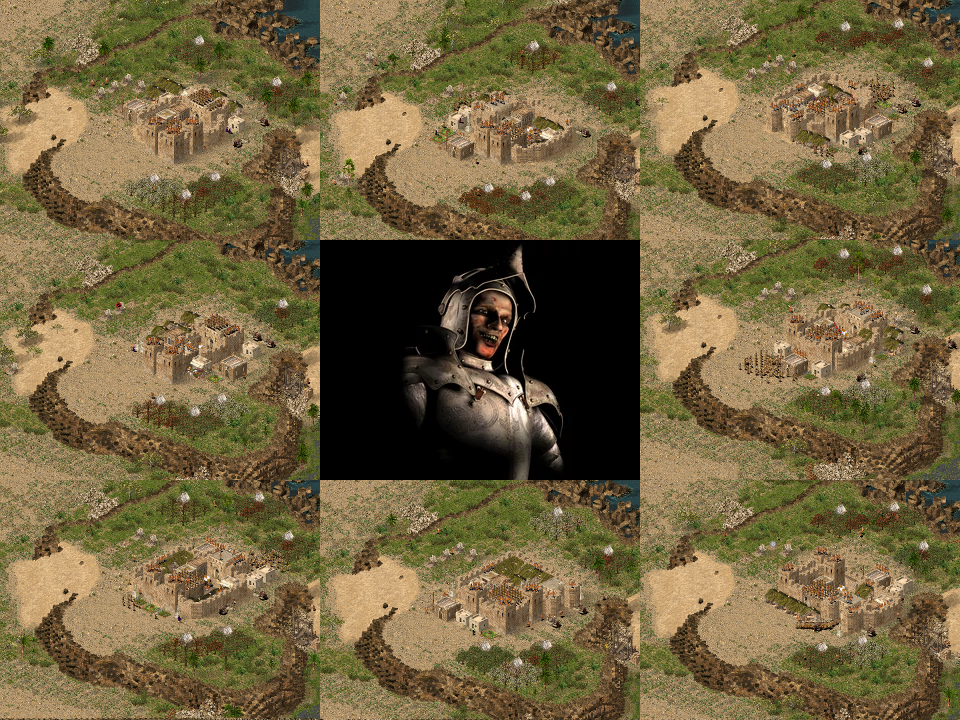

The Rat now actually builds a proper castle, which is inspired by Norman Keeps and high medieval gatehouses with flanking towers. Usually, the Rat encloses his granary and armoury within the castle walls, perhaps even very few weapon makers. The new Rat also builds some gardens or statues to boost what pitiful "army" he has.

What you see here is the Rat's smallest castle, which encloses nothing but the keep.

### The Snake

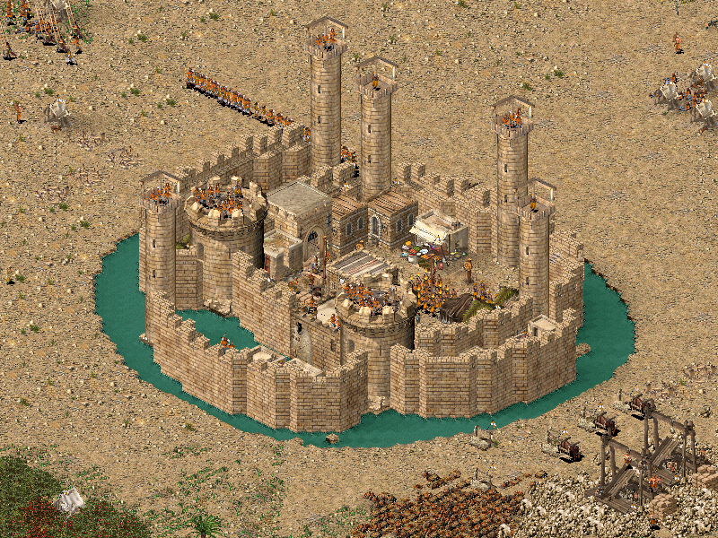

Did you like vanilla Snake #3, the snake-and-"S"-shaped castle? Well, that's his architectural style for all of his castles now. Curvy snake walls. To enhance the curvyness, the new Snake uses round towers only, making him the only european lord to use round towers.

As an easter egg, one of his castles is a rather... edge-y... rectangle-ish... thing using square-shaped towers.

### The Pig

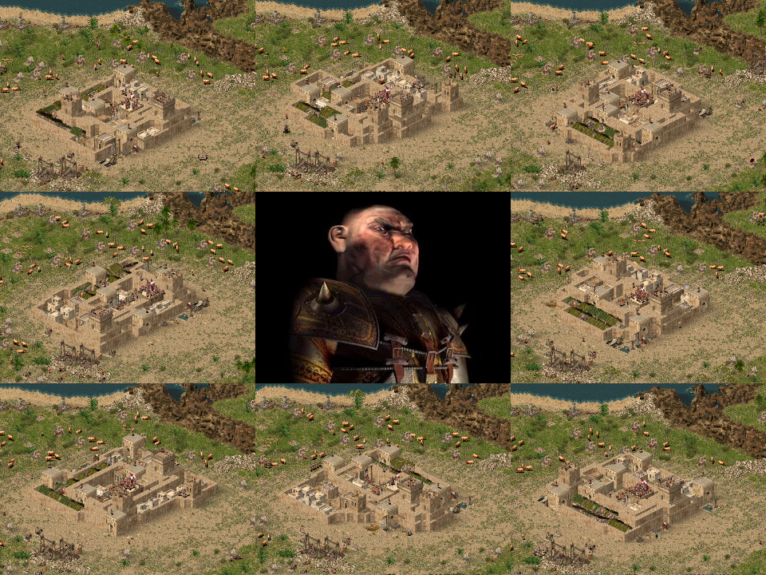

All in all, the pig still builds his... weird... wall thing with low walls. Granted, it does have style. This time, however, the Pig separates his castle into two sections. The inner castle, enclosed by high walls, has two big towers attached to it. One of those towers even has a tower mangonel. Good thing there aren't any campaign missions where you or your allies have your castles right next to a Pig, right...? Right...?! The second section is the castle village, enclosed by those small walls as you know and like them.

Unlike the vanilla castles, this Pig builds bad stuff all over the place. Dungeons, racks, chopping blocks,... almost everything there is to be built. This isn't enough to give him -5 popularity, but it surely is enough to emphasize his character. Really, why didn't Firefly give him more than occasionally two gallows?

### The Wolf

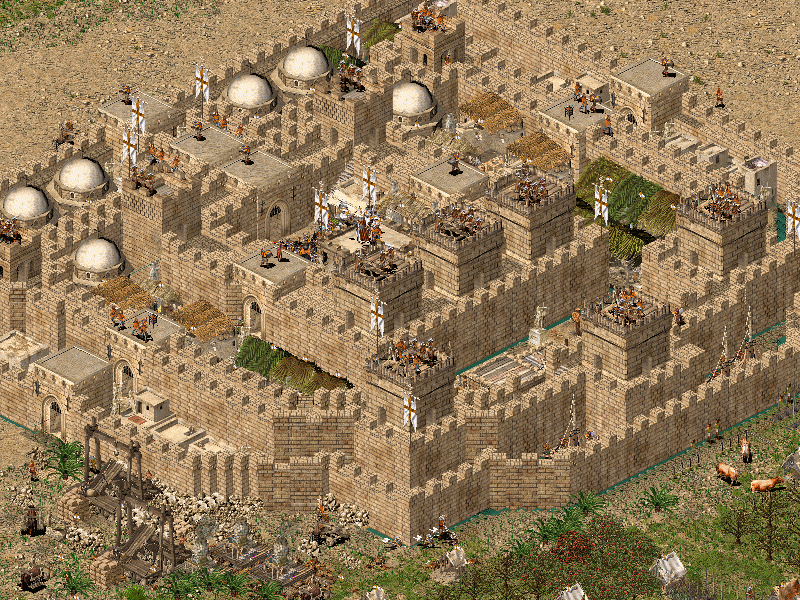

The Wolf now has a more unified architecture, though each of the castles still has a recognisable individual style. Basically, the Wolf now builds a thick rectangular center castle with two rows of three towers and two gates between those rows. Sometimes the shape is not very... rectangle-ish, though, as you can see in the screenshot. You can still see the general style of two three-tower-rows, though. The Wolf also no longer has multiple castle sections as you know them from e.g. Firefly's Wolf #1 or Wolf #3. This single section and thin outer wall architecture allows all of the Wolf's new castles to be way more compact than the Firefly versions.

As an easter egg the Wolf now also builds good stuff instead of gallows and what not, due to several hints in the lore of *Stronghold 3*. *(Yes, as a game Stronghold 3 is rubbish, but it had good ideas and the story around the Wolf was pretty neat.)*

### Sultan Saladin

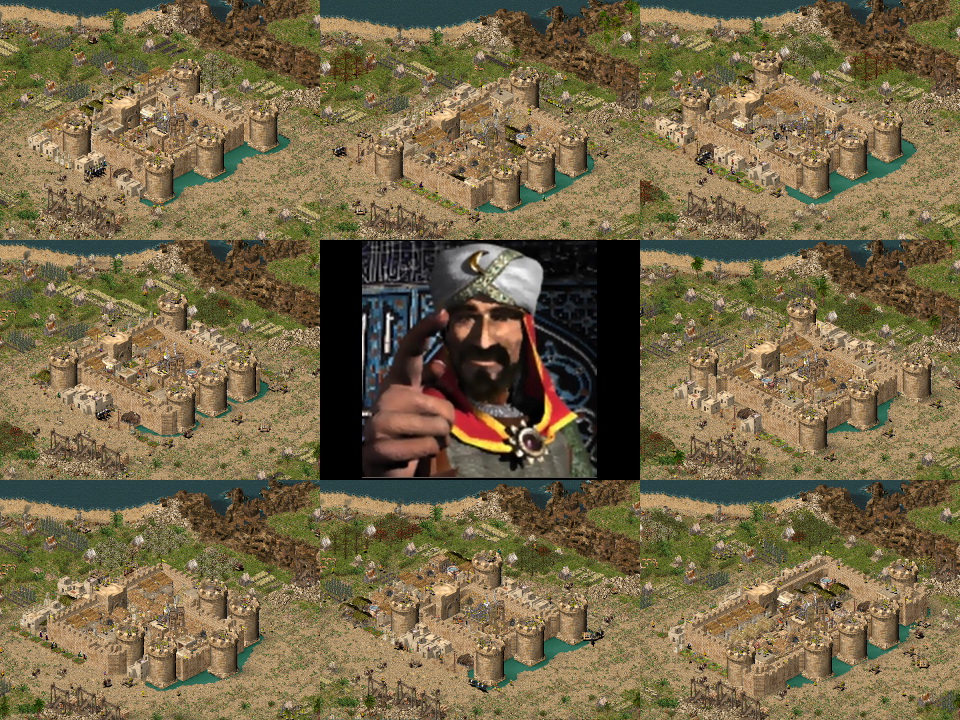

You might recognise his vanilla architecture, which is mostly influenced by vanilla Saladin #1. Similarly to the new Wolf, Saladin has a front line of three mangonel towers and a back defence of two ballista towers protecting his castle. In addition to that, he likes to cover his secondary entrances with towers like vanilla Saladin #1.

### The Caliph

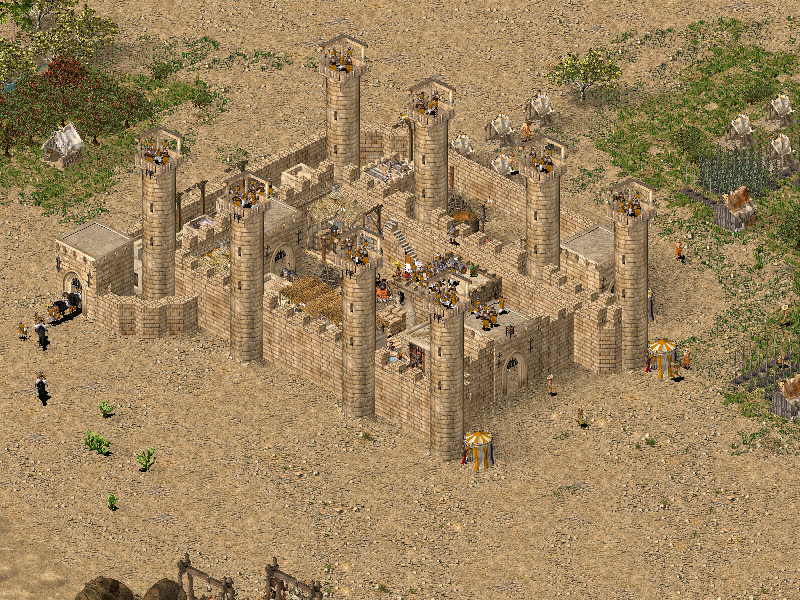

Oh, did you like his towers? Yeah, how do I say this... err... well, there is less of 'em. Eight towers, to be precise. Unlike before, those towers are heavily manned. Additionally, destroying the Caliph's toothpick towers does not create a breach. Thus, the Caliph completes his castles quicker and protects them better at the same time.

### The Sultan

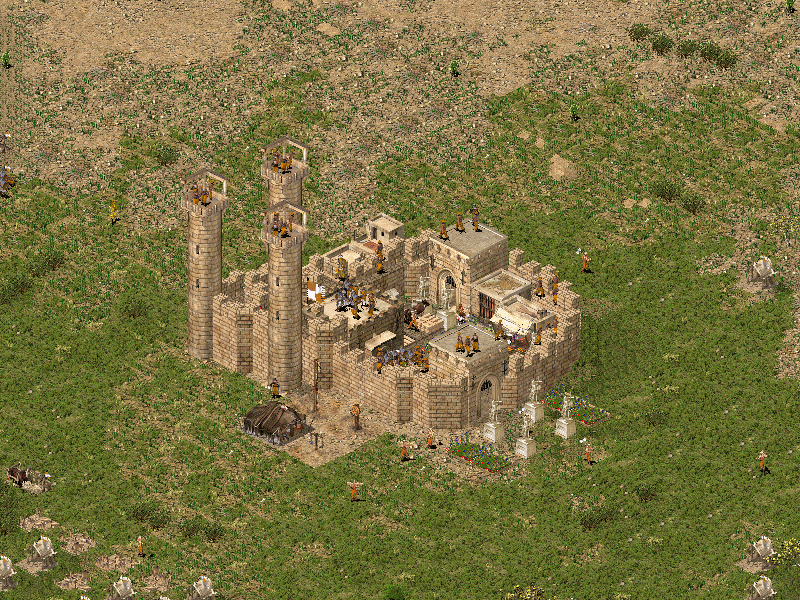

The Sultan loves round shapes. They remember him of his lovely olive twigs, the ones mourning whenever evil is done towards the poor Sultan. And he loves gardens a lot. At nights, the Sultan loves to lay down in his beautiful flower beds, watching the stars for clues about when would be the perfect time to attack you. As no mere civilian is allowed to disturb the Sultan while having his peace in the gardens, no house is allowed to be built within his palace's walls.

### King Richard the Lionheart

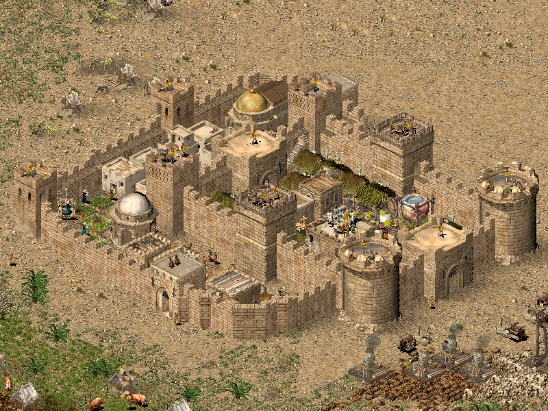

Huh... does this castle look familiar? I guess... could it be?! It is! Richard now builds the castle shown on the cover art of *Stronghold Crusader*. Completely unified with two round mangonel and two square ballistæ towers, and always a church and a chapel in his inventory.

Can you spot the easter egg? Well, have a close look at your *ally*. :)

### Kaiser Friedrich Barbarossa

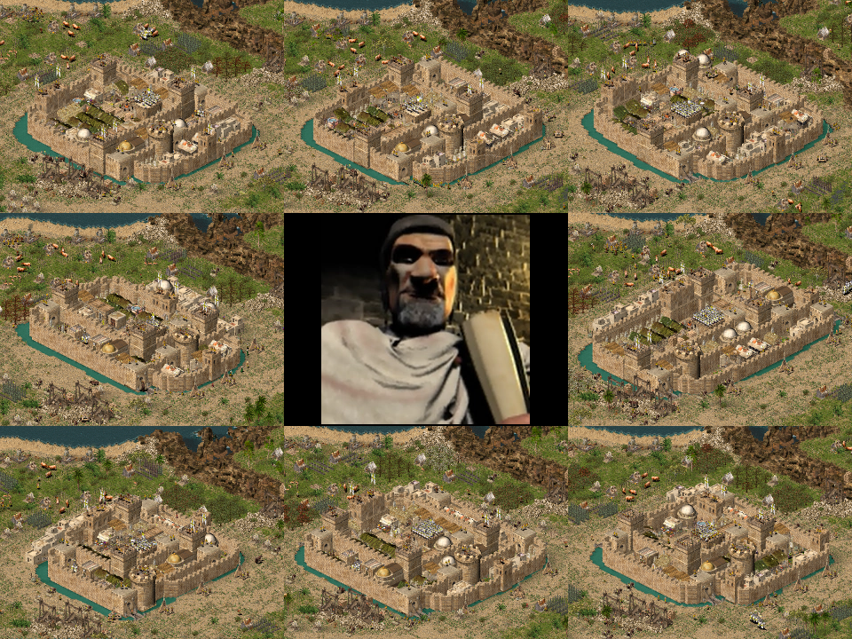

This castle has propably the most historically accurate layout you'll ever see in a Stronghold game. As an easter egg, all of Frederick's castles are architecturally inspired by the castle of Nürnberg. This castle is known to have been the favourite residence of many emperors of the so-called *Holy Empire* and thus I gave it to Frederick.

Frederick's castles consist of three sections, one in front of the next one. To improve his castle's defences, a section's walls are never connected to an other section's walls. And thus, unlike e.g. the castles of the original Wolf, you cannot take over the whole castle by pushing just one siege tower somewhere against the walls. The original castle is built on a hill-rock-thing. To compensate for the lack of such positions in *Stronghold Crusader*, Frederick's castles are surrounded by a thick moat.

### King Philippe II. Augustue

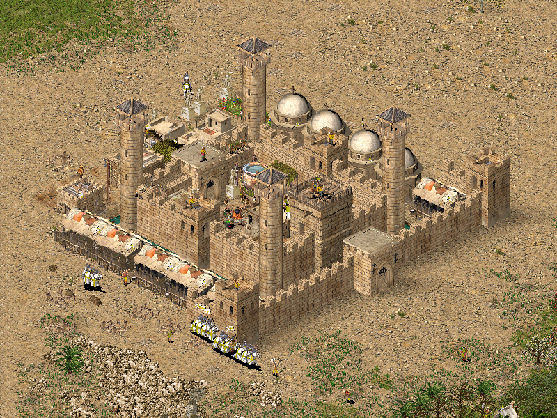

Well, it's Philip, so don't expect a defensive architectural masterpiece. I said don't! What is this? A proper starfort. With a watch tower. It's almost as if he got a level up in competence. And then this outer village wall. Small enough for the archers behind to shoot over it. A large moat with drawbridges. Ballista towers. Knights defending specific spots at the moat. I am almost impressed, and there surely is no way Philipp could have fucked up.

Well... he did. His Maginot Line is - *(not)* surprisingly - quite open at the back. Just walk around it and attack the star fort directly, or his economy. You might even walk around the outer wall to climb up its stairs. Did this guy think his castle architecture through? Perhaps he had to spend too much money for his gardens and churches, leaving no Gold coin for further stone purchases.

### The Wazir

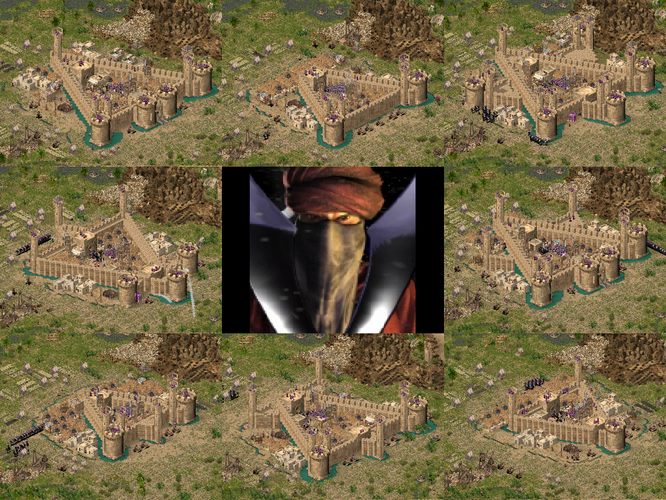

He went from star-shaped castles to a triangular one. Sometimes the Wazir adds external bastions to his inner castle, making it a double-triangle or six-pointed star. This shape allows him to keep his star-ish style while also being more space-efficient. Now, more of his bread industry can be built inside his inner castle, securing it from fires. The new Wazir also makes better use of moats, including the pitch ones. Oh, and did I mention that the Wazir now makes use of tower-mounted siege engines?

As a surprise, a few of his castles have a double-gatehouse with flanking towers.

### The Emir

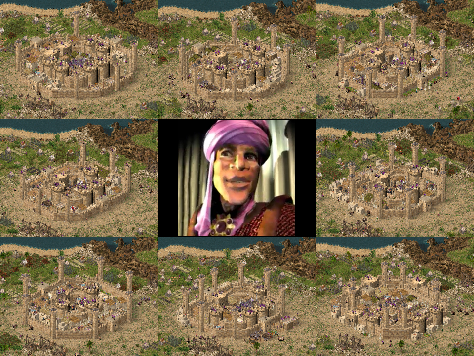

The new Emir now has an outer and an inner castle wall. His basic style is somewhat kept intact: An octagonal castle with big round towers and gatehouses on the edges. Unlike his vanilla design, though, the Emir's toothpick towers are no longer a path-blocking extension of his inner castle, but are connected to the corners or sometimes edges of his lower outer wall. This gives Emir's castle the feeling of a miniature city with a massive palace at its center.

As an easter egg, one of the Emir's castles has its walls swapped: The outer city wall is high, big, and has massive towers, whereas the inner wall is small, thin, and has those toothpicks attached to it.

### The Nizar

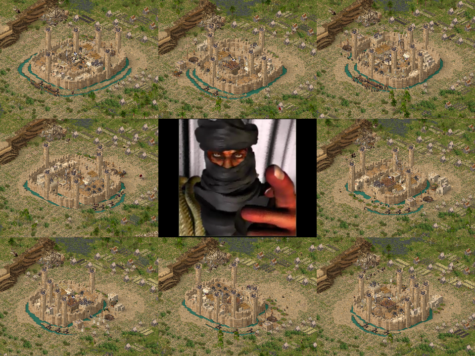

There are quite some changes made to the Nizar, though it might not seem like it at first. The most important change is that his new village is at least slightly more compact than his vanilla ones, allowing the moat to start earlier and thus be much wider. Oh, I forgot... *ahem*... *"Oh, did you like his moats? Yeah, how do I say this... err... well, there is more of 'em. Lots more."* But why? Being wider makes it easier for the Nizar to enclose his own farms with moat, in case he is placed too near to an oasis. As moats have a lower priority than buildings, the AI will never remove a farm to dig moats. For the Nizar this means that a farm nearby can create a huge opening in his moat, rendering all of his gatehouse defences useless. If, however, his farms are fully enclosed with moat and are thus unreachable, the Nizar will delete this farm and then dig his moat where the farm once was. To help him removing his own farms from his moat, the new Nizar builds sun ray walls into his moat.

An other design change is that his paths into the inner castle have been shortened a lot. What you see in this screenshot is his longest path. In vanilla, quite a few of the Nizar's castles have passages of up to four times this length, resulting in quite a weak economy. In addition to that, after a certain length it is way less dangerous to just fill up the whole moat in a straight line towards the keep than to send your army in circles along the entrance path, making those paths worse than useless.

Finally, the Nizar's gatehouses became a bit fancier, thanks to the addition of flanking towers.

### The Sheriff

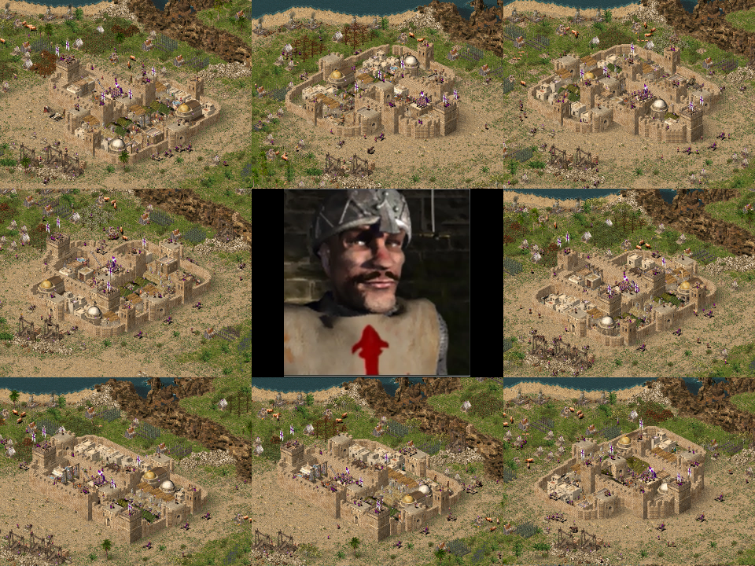

Do you like his vanilla design? Well, I do, which is why I kept the style. The Sheriff's new castles are basically a more compact version of the vanilla ones with added crenelations. As you might notice, one of the reasons why his new castles are so much more compact is that his houses are now placed outside of his castle. The Sheriff now collides less with the terrain or his neighbours.

Putting the poor civilian's houses outside of his fine and noble castle's walls certainly fits his character of being a cruel tyrant always raising taxes, even if the tax rate overshoots 100%. Gallows tower his low outer wall, so that everyone on the outside can see what happens to those who are too poor to pay. Thus, as an easter egg, one of the Sheriff's castles is completely reversed in its design. The outer village wall now encloses all the houses, banning the barracks outside. The village wall is high and thick, having big gatehouses and towers, giving the village extra protection. On the other hand, the Sheriff's inner castle has low and thin walls, small towers and a small gatehouse, making it the weakest part of this easter egg castle.

### The Marshall

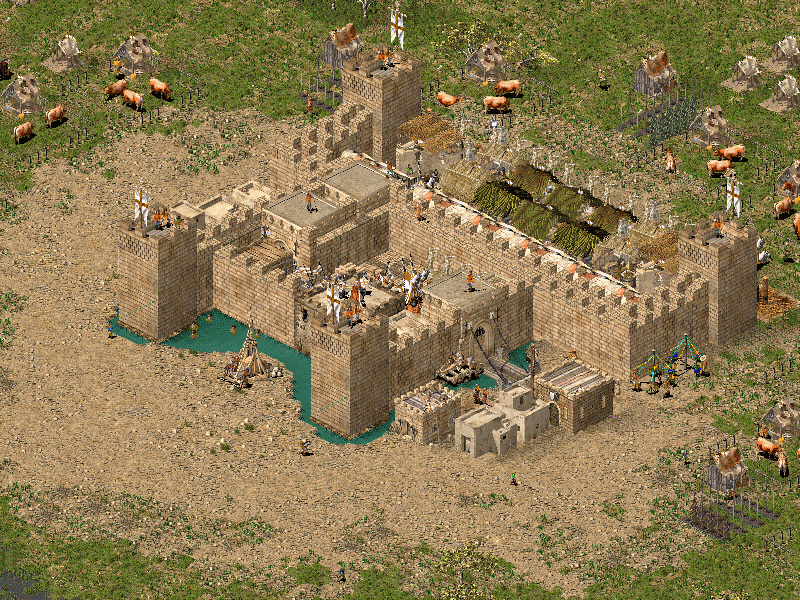

As with the Rat, you might not recognise the Marshall's new castle, at all, in that he now actually builds a rectangular starfort. He builds an inner starfort with high walls and an outer smaller wall in all of his castles. Especially due to his very low number of defensive archers, he really needs such an improved fortification to survive enemy attacks at all.

The Marshall is the only AI lord who does not build any towers, at all. There are two reasons for that. First, this speeds up repairing the fortification a lot. The AI is very slow at saving stones for towers, as the few stones on the stockpile are quickly used to build walls instead. Second, a proper starfort is all bastions and maybe a watchtower in the center.

### The Abbot

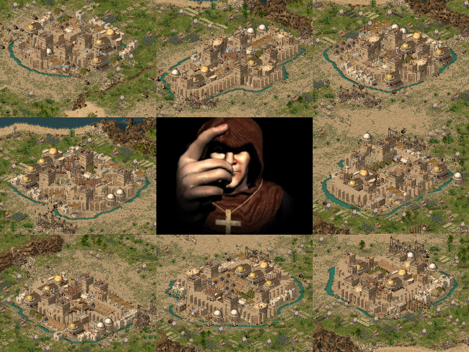

Again, a castle you might not recognise at all. This time, however, it is quite easy to just guess who lives there. The new Abbot's castle now has a shape similar to floor plans of gothic cathedrals. In addition to that, the new Abbot's castles are more compact than his vanilla ones and always have multiple entrances, fixing all those issues where the Abbot would imprison himself in way too tight spaces.

As a fun fact, the Abbot is the first AI lord I ever modded. Back then I just added a secondary front gatehouse to all of his castles.

As an easter egg, one of his castles is turned by 45°, resulting in an actual cross shape as seen by the player, instead of an X shape due to the isometric perspective.

## How can I contribute?

### Creating a Pull/Merge Request

As mentioned before, the *Stronghold Crusader Extreme* campaign is untested and might need a lot of fixes. At the same time, there might still be slight issues with the original 80 mission campaign or during random skirmish matches you might want to fix. You will need an installation of this game and the *"Stronghold Crusader AIV Editor"* to make any patches. To get the AIV editor, open your favourite search engine and look for *"Stronghold Crusader Community Tools"* or *"Stronghold Crusader Modding Tools"*. Once you have downloaded those tools, you have to copy this mod's files from the `./aiv/` folder into the AIV editor's `villages` folder. After that is done, you can start editing the AI castle files.

- Make sure that your fixes don't break any of the 80 campaign missions of *Stronghold Crusader*. As a fast check you can start a match at a speed of 90 and observe what the AI lords build during the first 3 to 10 minutes. In tighter spaces, however, longer observation will be required, as too many blocked houses will break the AI's industry thanks to a lack of workers.
- Also make sure that your fixes don't break the architectural style of this mod.
- The first construction steps of an AI lord should be, in order:
	1. More Stockpiles
	2. Granary
	3. Armoury
	4. Cathedral (Abbot)
	5. Barracks / Mercenary Post
	6. Engineer's Guild
	7. Tunnerlor's Guild (Richard)
	8. All the houses
	9. First wall sections
	10. Maybe first gatehouses or towers
- Make sure to insert 30-steps breaks at specific castle construction steps to give the AI time to collect e.g. more stone for towers to be built after the breaks.
- Don't forget to copy any changes back to your working copy of this repository. Also don't forget to copy your changes to your installation of *Stronghold Crusader* to test your changes.

If you are done editing your AI villages, submit a pull request containing the following information:

- Describe what you changed.
- Describe *why* you changed specific things. This is most important.
- Please, add a screenshot showing the issue with the original mod castle.
- Please, also add a screenshot showing your changes in action.
- If your pull request fixes specific campaign missions, then list them as `Crusader #1-80` or `Extreme #1-25`.
- If your pull request fixes a custom skirmish match, then add the following information:
	- Add a screenshot showing your custom skirmish configuration.
	- The screenshot needs to show the chosen AI opponents, their colours, their names, and their positions on the map.
	- The screenshot also needs to show the game mode and the start resources.
	- And it obviously needs to show the chosen map. Only Firefly originals in single player mode are valid. No fixes for custom maps made by the comminity or yourself. If an AI lord has an issue with custom-made maps, then fix the custom-made maps. Also don't submit fixes for something that occurred during a multiplayer game, as this makes it hard to reproduce the original issues.

### Just filing an Issue

In case you don't feel competent enough to use Firefly's AIV Editor, or if the AIV Editor simply doesn't work on your computer and operating system, or if you just lack the time to fix things yourself, you can just file an issue, so that I can have a look at the problem and fix it myself. Though I cannot guarantee to have time for that myself right away, I will eventually.

When creating an issue, I will need about the same information as for pull requests:

- Describe what should be changed.
- Describe why this should be changed.
- Add a screenshot showing the issue you have.
- If the issue occurred during specific campaign missions, then list them as `Crusader #1-80` or `Extreme #1-25`.
- If this issue occurred during a custom skirmish match, then add the following information:
	- Add a screenshot showing your custom skirmish configuration.
	- The screenshot needs to show the chosen AI opponents, their colours, their names, and their positions on the map.
	- The screenshot also needs to show the game mode and the start resources.
	- And it obviously needs to show the chosen map. Only Firefly originals in single player mode are valid. Don't file issues for custom maps made by the comminity or yourself. If an AI lord has an issue with custom-made maps, then fix the custom-made maps. Also don't submit issues for something that occurred during a multiplayer game, as this makes it hard to reproduce the original issues.

### Suggesting a re-design of an AI lord

In case you have an idea on how to improve the castle designs of a specific AI lord, e.g. if you have an idea for sexier Sultan castles, then feel free to create an issue so that we can discuss your ideas.

As exact castle layouts in *Stronghold Crusader* are hard to describe, you should add pictures in your issue showing your design ideas. Those pictures can be any of...

- ... pencil drawings on paper.
- ... a screenshot of an AI lord's or your own castle while in the game. In ye olden days, I used the sandbox mode or the map editor to plan AI castles.
- ... a screenshot of the AIV Editor showing your new castle design, propably accompanied by the actual `.aiv` file.

Also, don't forget to mention which castle(s) your designs are meant to replace, what the benefits of your designs are, what you missed in the original mod designs, etc.

## License

Keep in mind that this is just a mod for *Firefly Studio's* game *Stronghold Crusader (Extreme) HD*. Without this game, this mod is worth nothing.

Anyways, the mod itself is published under the MIT license:

- Understandable description on [tl;dr legal](https://tldrlegal.com/license/mit-license)
- [Full license text](./LICENSE-MIT.md)
